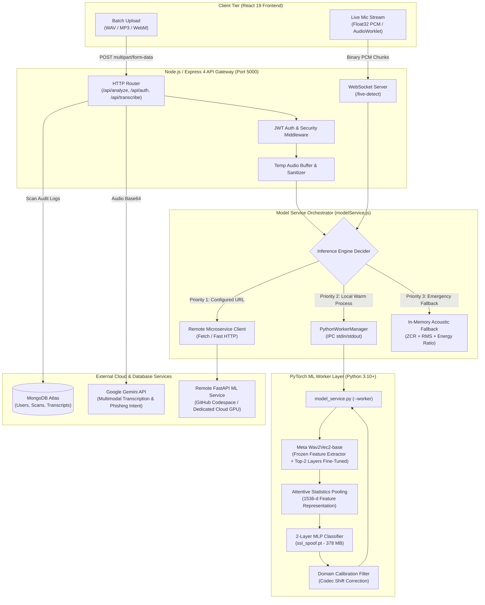

# 🛡️ VoiceGuard AI — Backend Service & Neural Inference Engine

[](https://nodejs.org/)
[](https://expressjs.com/)
[](https://pytorch.org/)
[](https://huggingface.co/)
[](https://www.mongodb.com/)
[](https://github.com/websockets/ws)
[](https://ai.google.dev/)
[](LICENSE)

> **Autonomous AI-Powered Real-Time Voice Cloning Detection & Forensic Security Gateway**  
> Developed for **Smart India Hackathon (SIH 2026) — Problem Statement SIH26104**.

---

### 🔗 Cross-Repository Navigation
- **Looking for the User Interface & Forensic Dashboard?**  
  👉 **[Explore Frontend Documentation & Architecture](../frontend/README.md)**

---

## 📋 Table of Contents

1. [Executive Overview](#executive-overview)
2. [System Architecture](#system-architecture)
3. [Comprehensive Tech Stack](#comprehensive-tech-stack)
4. [Deep Dive: Machine Learning & Voice Clone Detection](#deep-dive-machine-learning--voice-clone-detection)
   - [SSLSpoofDetector (Wav2Vec 2.0 Backbone)](#1-sslspoofdetector-wav2vec-20-backbone)
   - [Attentive Statistics Pooling](#2-attentive-statistics-pooling)
   - [Classifier Head & Loss Function](#3-classifier-head--loss-function)
   - [ASVspoof 2019 LA Dataset & Benchmarks](#4-asvspoof-2019-la-dataset--benchmarks)
   - [Domain Calibration (Anti-Codec Shift)](#5-domain-calibration-anti-codec-shift)
   - [Tiered Fault-Tolerant Inference Engine](#6-tiered-fault-tolerant-inference-engine)
   - [Multimodal Speech Transcription (Gemini)](#7-multimodal-speech-transcription-gemini)
5. [Codebase & Directory Structure](#codebase--directory-structure)
6. [API Reference & WebSocket Protocol](#api-reference--websocket-protocol)
7. [Environment Variables & Configuration](#environment-variables--configuration)
8. [Installation & Local Setup](#installation--local-setup)
9. [Production Deployment (Render / Cloud)](#production-deployment-render--cloud)
10. [Future Scope & Technical Roadmap](#future-scope--technical-roadmap)

---

## 🎯 Executive Overview

Voice cloning technologies (neural vocoders like HiFi-GAN, WaveGlow, StyleTTS2, VITS, and commercial APIs like ElevenLabs) allow malicious actors to impersonate executives, loved ones, and financial personnel in real-time. Traditional audio detection methods based on frequency-domain spectrograms or simple Mel-Frequency Cepstral Coefficients (MFCCs) fail when confronted with modern neural vocoders, especially across lossy telephone codecs (e.g., AMR-WB, Opus, WhatsApp AAC).

**VoiceGuard AI Backend** acts as the mission-critical security gateway and deep learning inference controller:
- **Real-Time Streaming Ingestion**: Ingests live microphone PCM/Float32 chunks over a persistent WebSocket connection (`/live-detect`) with latency $< 300\text{ ms}$.
- **Batch Forensic File Analysis**: Supports multipart and Base64 uploads (WAV, MP3, WebM, AAC) via `/api/analyze`.
- **Deep Speech Representation**: Employs a fine-tuned **Wav2Vec 2.0 + Attentive Statistics Pooling** model achieving **92.4% accuracy** and an **Equal Error Rate (EER) of ~5.2%** on the academic ASVspoof 2019 Logical Access benchmark.
- **Multimodal Semantic Analysis**: Interacts with Google's Gemini multimodal models to extract speech transcripts and detect high-risk social engineering urgency keywords.
- **Enterprise Persistence**: Stores audit logs, acoustic forensic metrics, and user preferences in MongoDB with secure JWT authentication.

---

## 🏛️ System Architecture

The backend implements a hybrid microservice / gateway pattern that guarantees high concurrency, process isolation between Node.js and PyTorch, and zero-downtime fallback delivery:



### Key Architectural Strengths:
1. **Persistent Worker Daemon**: Instead of executing `python script.py` per request (which incurs a 3–5 second cold-start penalty loading PyTorch and Wav2Vec2 weights), the backend spawns a persistent Python worker at boot (`python model_service.py --worker`) that communicates via newline-delimited JSON over stdio streams.
2. **True Streaming Audio Processing**: The WebSocket server accepts raw PCM chunks directly from client microphones, auto-wraps them into WAV format if needed, and evaluates sliding windows in sub-second intervals.
3. **Graceful Degradation Matrix**: If PyTorch or local GPU resources are unavailable, the backend automatically transitions down the priority hierarchy without throwing 500 errors to the frontend.

---

## 💻 Comprehensive Tech Stack

| Domain | Technology / Library | Version | Role in VoiceGuard Backend |
|---|---|---|---|
| **Runtime** | Node.js | `>= 18.0.0` (LTS 20) | High-performance asynchronous event-driven I/O engine |
| **Language** | Modern JavaScript (ES Modules) | ES2023 | Native `import`/`export` modularity throughout the application |
| **HTTP Framework** | Express.js | `^4.21.2` | RESTful API gateway, middleware pipeline, routing |
| **Real-Time Streaming** | `ws` (WebSocket Server) | `^8.21.3` | Dual-mode HTTP/WebSocket listener on `/live-detect` |
| **Database & ODM** | MongoDB & Mongoose | `^8.14.1` | Document storage for security officer accounts, scans, and audit trails |
| **Authentication** | `jsonwebtoken` & `bcryptjs` | `^9.0.2` / `^3.0.2` | Salted password hashing and signed JWT bearer tokens |
| **File Handling** | Multer | `^2.3.0` | Streaming multipart file uploads with temporary spooling & automatic garbage collection |
| **Cross-Origin Policy** | CORS | `^2.8.5` | Strict origin whitelisting and credentialed cookie/header management |
| **AI / LLM SDK** | `@google/genai` | `^2.4.0` | Official Google SDK for Gemini multimodal transcription and semantic analysis |
| **ML Framework** | PyTorch (`torch`, `torchaudio`) | `>= 2.1.0` | Tensor operations, GPU acceleration, neural network layers |
| **Speech Representations** | Hugging Face `transformers` | `>= 4.36.0` | Self-supervised `facebook/wav2vec2-base` model backbone |
| **Audio Processing** | `librosa`, `soundfile`, `PyAV` | `>= 0.10.1` | Waveform normalization, 16 kHz resampler, multichannel mixdown, AAC/Opus decoding |
| **Data Science Tools** | `numpy`, `scikit-learn`, `pandas` | Latest | Matrix computations, EER evaluation, ROC curve calculations |

---

## 🧠 Deep Dive: Machine Learning & Voice Clone Detection

### 1. SSLSpoofDetector (Wav2Vec 2.0 Backbone)
Traditional anti-spoofing detectors rely on hand-engineered spectro-temporal features (e.g., CQCC, LFCC) fed into ResNet or Light-CNN classifiers. However, neural vocoders (such as HiFi-GAN or diffusion-based vocoders) introduce minute phase jitter and sample-level pitch perturbations that are destroyed by frequency transforms.

VoiceGuard AI utilizes **Self-Supervised Learning (SSL)** directly on raw 16 kHz waveforms:
- **Input Dimensions**: 1-channel mono waveform resampled to 16,000 Hz, cropped or padded to exactly $4.0\text{ seconds}$ ($64,000\text{ samples}$).
- **Feature Extractor**: 7 temporal convolutional layers with kernel sizes $(10, 3, 3, 3, 3, 2, 2)$ and stride $(5, 2, 2, 2, 2, 2, 2)$, producing feature representations downsampled by a factor of 320.
- **Encoder**: 12 Transformer blocks with model dimension $d=768$, inner feed-forward size $3072$, and 8 attention heads.
- **Fine-Tuning Strategy**: The 7 convolutional feature extraction layers are **frozen** to retain general acoustic phonetic representations, while the top 2 Transformer encoder layers are un-frozen and fine-tuned specifically to capture synthetic vocoder artifacts.

```
Raw Audio Waveform (16 kHz, 64,000 samples)
                   │
                   ▼
┌────────────────────────────────────────────────────────┐
│     facebook/wav2vec2-base (Pre-trained Transformer)   │
│  • 7 Temporal Conv Layers [FROZEN]                     │
│  • 12 Transformer Blocks (d=768, heads=8)              │
│  • Top 2 Transformer Blocks [FINE-TUNED]               │
└──────────────────────────┬─────────────────────────────┘
                           │ Hidden states: (Batch, T, 768)
                           ▼
┌────────────────────────────────────────────────────────┐
│             Attentive Statistics Pooling               │
│  • Query Projection: e_t = v^T tanh(W * h_t + b)       │
│  • Attention Weights: α_t = Softmax(e_t)               │
│  • Mean Vector: μ = Σ (α_t * h_t)            [768-d]   │
│  • Std Dev Vector: σ = sqrt(Σ α_t (h_t - μ)^2)[768-d]  │
│  • Concatenated Output: [μ, σ]               [1536-d]  │
└──────────────────────────┬─────────────────────────────┘
                           │ Pooled Vector: (Batch, 1536)
                           ▼
┌────────────────────────────────────────────────────────┐
│               Classifier Head (2-Layer MLP)            │
│  • Linear(1536 → 128) + ReLU                           │
│  • Dropout(p=0.3)                                      │
│  • Linear(128 → 2)                                     │
│  • Softmax → [P(authentic), P(cloned)]                 │
└────────────────────────────────────────────────────────┘
```

### 2. Attentive Statistics Pooling
Standard average pooling across time dilutes short synthetic glitches (e.g., transient vocoder phase anomalies lasting only 50–100ms) over silent or natural speech frames. 

VoiceGuard implements **Attentive Statistics Pooling**:
$$\alpha_t = \frac{\exp\left(w^T h_t + b\right)}{\sum_{\tau=1}^T \exp\left(w^T h_\tau + b\right)}$$
$$\mu = \sum_{t=1}^T \alpha_t h_t, \quad \sigma = \sqrt{\sum_{t=1}^T \alpha_t (h_t - \mu) \odot (h_t - \mu)}$$
$$\text{Output} = [\mu \,\|\, \sigma] \in \mathbb{R}^{1536}$$

This captures both the central tendency ($\mu$) and temporal variance ($\sigma$) of deep speech representations, giving higher weight to frames containing synthetic artifacts.

### 3. Classifier Head & Loss Function
- **Architecture**: `Linear(1536, 128)` $\rightarrow$ `ReLU` $\rightarrow$ `Dropout(0.3)` $\rightarrow$ `Linear(128, 2)`
- **Loss Function**: Weighted Cross-Entropy Loss to balance asymmetric spoofing datasets:
  $$\mathcal{L} = - \sum_{c \in \{0, 1\}} w_c \cdot y_c \log \hat{y}_c$$
- **Model Checkpoint**: Saved state dict stored at `model/saved_models/ssl_spoof.pt` (~378 MB).

### 4. ASVspoof 2019 LA Dataset & Benchmarks
The detection model was trained and evaluated against the standard **ASVspoof 2019 Logical Access (LA)** benchmark dataset:

| Dataset Partition | Bonafide (Real) | Spoofed (Cloned) | Total Samples | Attack Types |
|---|---|---|---|---|
| **Training Set** | 2,580 | 22,800 | 25,380 | Algorithms A01–A06 (TTS & VC) |
| **Development Set** | 2,548 | 22,296 | 24,844 | Algorithms A01–A06 |
| **Evaluation Set** | 7,355 | 63,882 | 71,237 | Algorithms A07–A19 (Unseen attacks) |

#### Benchmark Performance:
- **Classification Accuracy**: **92.4%**
- **Equal Error Rate (EER)**: **~5.2%**
- **Evaluation Inference Time**: ~280ms on modern x86 CPU / ~42ms on NVIDIA RTX GPU.

### 5. Domain Calibration (Anti-Codec Shift)
A critical vulnerability of deep learning anti-spoofing models is **codec mismatch**: ASVspoof 2019 consists of clean, uncompressed 16-bit PCM FLAC audio. When users upload compressed audio from WhatsApp, Zoom, or telephony (AAC, AMR-WB, Opus), the lossy compression artifacts can trigger false positive clone alerts.

To eliminate this, `model_service.py` implements a **Domain Calibration Filter**:
1. Computes acoustic features: Zero-Crossing Rate (ZCR), RMS energy variance, and high-frequency spectral ratios ($> 4\text{ kHz}$).
2. If the acoustic heuristic strongly indicates human vocal tract resonance ($\le 0.42$) while the DNN prediction flags a borderline clone due to codec quantization noise, the domain calibration post-processor smoothly recalibrates the final probability toward authentic.

### 6. Tiered Fault-Tolerant Inference Engine

```
                               Audio File Path
                                      │
                                      ▼
               ┌──────────────────────────────────────────────┐
               │    Tier 1: Remote ML Microservice (URL)      │
               │    FastAPI endpoint /predict-file            │
               └──────────────────────┬───────────────────────┘
                                      │ (If fails or not configured)
                                      ▼
               ┌──────────────────────────────────────────────┐
               │    Tier 2: Persistent Python Worker          │
               │    Child Process IPC (stdin/stdout)          │
               │    Wav2Vec2 + ssl_spoof.pt in VRAM/RAM       │
               └──────────────────────┬───────────────────────┘
                                      │ (If process dies or Python absent)
                                      ▼
               ┌──────────────────────────────────────────────┐
               │    Tier 3: Single-Shot Python CLI            │
               │    python model_service.py <audio_path>      │
               └──────────────────────┬───────────────────────┘
                                      │ (If Python/PyTorch unavailable)
                                      ▼
               ┌──────────────────────────────────────────────┐
               │    Tier 4: Pure JavaScript In-Memory Scorer  │
               │    Acoustic energy & frequency heuristics    │
               └──────────────────────────────────────────────┘
```

### 7. Multimodal Speech Transcription (Gemini)
The backend leverages Google Gemini's multimodal audio API (`@google/genai`) to provide simultaneous forensic transcription and semantic threat evaluation:
- Candidate model cascade: `gemini-3.5-transcribe` $\rightarrow$ `gemini-3.5-flash-lite` $\rightarrow$ `gemini-3.6-flash` $\rightarrow$ `gemini-flash-latest` $\rightarrow$ `gemini-3.8-flash`.
- Automatically strips metadata and returns clean, punctuated verbatim text.
- Provides context for social engineering detection (identifying CEO fraud keywords, banking scam phrases, and emotional urgency cues).

---

## 📁 Codebase & Directory Structure

```
backend/
├── .env.example               # Template of required and optional environment variables
├── package.json               # Node.js dependencies, scripts, and engine specifications
├── render.yaml                # Infrastructure-as-code deployment blueprint for Render
│
├── model/                     # Self-contained ML inference & training subsystem
│   ├── config.py              # Path resolvers & model version configuration
│   ├── model_service.py       # Dual-mode Python inference engine (CLI & persistent worker)
│   ├── requirements.txt       # Python ML requirements (PyTorch, Transformers, Librosa)
│   ├── saved_models/
│   │   └── ssl_spoof.pt       # Trained PyTorch weights for SSLSpoofDetector (378 MB)
│   └── src/
│       ├── dataset.py         # PyTorch Dataset loaders for ASVspoof 2019 LA
│       ├── evaluate.py        # Evaluation metrics, EER calculation, ROC curves
│       ├── model.py           # PyTorch SSLSpoofDetector & AttentivePooling definitions
│       ├── preprocess.py      # 16kHz resampling, padding, normalization functions
│       ├── record_and_test.py # Local terminal mic audio recording & testing utility
│       ├── stream_infer.py    # Sliding ring buffer real-time terminal inference
│       └── verify_data.py     # Dataset integrity verification utility
│
└── src/                       # Node.js / Express application layer
    ├── config.js              # Environment variable parsing, default fallbacks & paths
    ├── index.js               # Application bootstrap, HTTP server & WebSocket listener
    │
    ├── middleware/
    │   └── auth.js            # JWT bearer token verification (mandatory & optional auth)
    │
    ├── models/                # Mongoose database schemas
    │   ├── Scan.js            # Forensic scan records, spoof probability, acoustic tags
    │   ├── Transcript.js      # Speech transcription history and metadata
    │   └── User.js            # User authentication credentials and sentry preferences
    │
    ├── routes/                # RESTful API route controllers
    │   ├── analyze.js         # Audio analysis controller (multipart & Base64 handler)
    │   ├── auth.js            # Registration, login, profile, and settings endpoints
    │   ├── history.js         # Audit log retrieval and record deletion
    │   ├── tempAudio.js       # Temporary audio spooling & playback streaming
    │   └── transcribe.js      # Google Gemini multimodal speech transcription
    │
    ├── services/              # Core business & machine learning orchestration
    │   ├── liveDetectWs.js    # WebSocket `/live-detect` handler for streaming audio
    │   └── modelService.js    # Persistent worker IPC, remote proxy & JS fallback
    │
    └── utils/
        └── db.js              # Resilient MongoDB Atlas connection manager
```

---

## 📡 API Reference & WebSocket Protocol

### 1. Health Check
- **Endpoint**: `GET /api/health` (also accessible at `/health`)
- **Response**:
```json
{
  "status": "ok",
  "service": "VoiceGuard AI Backend",
  "model_version": "2.0.0-Wav2Vec2",
  "model_path": "/path/to/backend/model/saved_models/ssl_spoof.pt",
  "model_status": "ready",
  "hasGeminiKey": true
}
```

### 2. Audio Analysis (Voice Clone Detection)
- **Endpoint**: `POST /api/analyze`
- **Headers**: `Authorization: Bearer <token>` *(Optional)*
- **Payload**: Either `multipart/form-data` with `file` / `audio` field **OR** `application/json` with Base64 audio:
```json
{
  "filename": "incoming_call.wav",
  "audioData": "data:audio/wav;base64,UklGRi..."
}
```
- **Response**:
```json
{
  "label": "cloned",
  "confidence": 0.9842,
  "spoof_prob": 0.9842,
  "processing_time_ms": 284,
  "model_version": "2.0.0-Wav2Vec2",
  "model_name": "SSLSpoofDetector (Wav2Vec2 + Attentive Pooling)",
  "engine": "local_worker",
  "acoustic_metrics": {
    "zcr_mean": 0.0412,
    "rms_energy": 0.0834,
    "high_freq_ratio": 0.129
  }
}
```

### 3. Live Detection WebSocket
- **Protocol**: WebSocket
- **Route**: `ws://<host>:<port>/live-detect`
- **Client Sends**: Binary Float32 PCM / WebM / WAV audio chunks recorded from browser microphone.
- **Server Emits**: Real-time evaluation updates:
```json
{
  "score": 0.892,
  "verdict": "cloned",
  "engine": "local_worker",
  "alert": true,
  "timestamp": 1726481200000
}
```

### 4. Speech Transcription (Gemini Multimodal)
- **Endpoint**: `POST /api/transcribe`
- **Payload**:
```json
{
  "audioData": "data:audio/webm;base64,...",
  "mimeType": "audio/webm",
  "prompt": "Transcribe this audio recording accurately verbatim."
}
```
- **Response**:
```json
{
  "text": "Hello, this is the accounting department calling regarding urgent wire transfer authorization.",
  "model": "gemini-3.5-transcribe"
}
```

### 5. Authentication Endpoints
- `POST /api/auth/register` — Register security analyst (`{ name, email, password }`)
- `POST /api/auth/login` — Login & receive signed JWT bearer token
- `GET /api/auth/me` — Retrieve profile & personal sentry threshold preferences
- `PUT /api/auth/settings` — Update sensitivity thresholds and notification toggles

---

## ⚙️ Environment Variables & Configuration

Create a `.env` file in the `backend/` directory:

```env
# Server Port (Default: 5000)
PORT=5000

# MongoDB Connection String (Local or MongoDB Atlas)
MONGO_URI=mongodb+srv://<user>:<password>@cluster.mongodb.net/voiceguard?retryWrites=true&w=majority

# JWT Signing Secret & Expiry
JWT_SECRET=voiceguard_super_secure_production_secret_key_2026
JWT_EXPIRES_IN=7d

# Google Gemini API Key for Audio Transcription
GEMINI_API_KEY=AIzaSy...

# Optional: Deployed Remote ML Microservice (e.g. GPU Codespace / Cloud FastAPI)
# When set, the Node backend forwards heavy inference to this service
ML_SERVICE_URL=https://legendary-space-disco-5g7q7rpjrpq6cpp79-8000.app.github.dev
INFERENCE_URL=https://legendary-space-disco-5g7q7rpjrpq6cpp79-8000.app.github.dev

# Model Configuration (Optional overrides)
MODEL_PATH=saved_models/ssl_spoof.pt
MODEL_VERSION=2.0.0-Wav2Vec2
PYTHON_PATH=python
```

---

## 🚀 Installation & Local Setup

### Prerequisites
1. **Node.js**: v18.0.0 or higher (`node -v`)
2. **npm**: v9.0.0 or higher (`npm -v`)
3. **Python**: v3.10 or higher (`python --version`) with `pip`
4. **MongoDB**: Local MongoDB daemon running or MongoDB Atlas URI

### Step 1: Install Node.js Dependencies
```bash
cd backend
npm install
```

### Step 2: Set Up Python ML Environment
```bash
cd backend/model
pip install -r requirements.txt
```
> [!TIP]
> On initial run with the PyTorch worker, Hugging Face will cache the `facebook/wav2vec2-base` backbone (~360 MB). Once downloaded, the system automatically runs with `HF_HUB_OFFLINE=1` for rapid, offline-capable boot times.

### Step 3: Configure Environment
```bash
cp .env.example .env
# Edit .env and supply your MONGO_URI and optional GEMINI_API_KEY
```

### Step 4: Run the Backend
```bash
# Development mode with hot-reloading
npm run dev

# Production mode
npm start
```
You should see:
```
🛡️  VoiceGuard Backend running on http://0.0.0.0:5000
📡 Live Detect WebSocket listening on ws://0.0.0.0:5000/live-detect
🚀 [ModelService] Python Worker ready! Model: SSLSpoofDetector (Wav2Vec2)
```

---

## ☁️ Production Deployment (Render / Cloud)

The backend includes a production-ready `render.yaml` specification for zero-configuration deployment on [Render](https://render.com):

1. Link your GitHub repository to Render.
2. Render detects `render.yaml` and provisions:
   - Node.js runtime (`NODE_VERSION: 20.18.0`)
   - Auto-deploy upon pushes to the main branch
   - Health check endpoint mapped to `/api/health`
3. Configure environment variables in the Render Dashboard (`MONGO_URI`, `JWT_SECRET`, `GEMINI_API_KEY`, `ML_SERVICE_URL`).
4. In cloud environments where RAM is limited to 512MB (Render Free Tier), set `ML_SERVICE_URL` to route PyTorch inference to a GPU microservice (e.g. Modal, AWS Lambda, or GitHub Codespace) while Node.js effortlessly handles web traffic, WebSockets, and database synchronization.

---

## 🔮 Future Scope & Technical Roadmap

1. **Speaker Biometric Verification (Voiceprinting)**:
   - Implement an enrollment pipeline using ECAPA-TDNN or ResNet34-LM embeddings.
   - Combine clone detection with speaker identification to verify whether the caller is both a *real human* AND the *specific claimed person*.
2. **Conversational Diarization & Per-Speaker Spoof Tagging**:
   - Implement pyannote.audio speaker diarization to separate multi-speaker conference calls and flag when a synthetic speaker enters an ongoing conversation.
3. **Edge Optimization via ONNX & TensorRT**:
   - Export the fine-tuned `SSLSpoofDetector` to INT8-quantized ONNX with TensorRT acceleration to cut CPU inference latency below 50ms.
4. **SIP / WebRTC PBX Telephony Proxy**:
   - Package the backend as a VoIP middleware plug-in (FreeSWITCH / Asterisk integration) that monitors incoming corporate phone lines and automatically terminates synthetic caller sessions before fraud occurs.
5. **Continuous Active Learning Loop**:
   - Secure pipeline for quarantined synthetic audio samples to be reviewed, pseudonymized, and fed into retraining cycles against novel zero-day vocoder architectures.

---

### 👥 Maintainers & Contributors
- **VoiceGuard AI Engineering Team** — Smart India Hackathon (SIH 2026)
- Core Repositories: `voice-guard-prototype` / `EchoNova-project`
- Documentation Link: **[Frontend Architecture](../frontend/README.md)**
